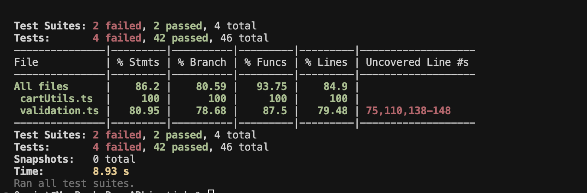

<style>
body {
    font-family: 'Times New Roman', serif;
    font-size: 12pt;
    line-height: 1.5;
    text-align: justify;
    margin: 1in;
    color: #000000;
}

h1 {
    font-size: 16pt;
    font-weight: bold;
    text-align: center;
    margin-top: 2em;
    margin-bottom: 1em;
    page-break-before: always;
    text-transform: uppercase;
}

h2 {
    font-size: 14pt;
    font-weight: bold;
    margin-top: 1.5em;
    margin-bottom: 0.5em;
    text-transform: capitalize;
}

h3 {
    font-size: 12pt;
    font-weight: bold;
    margin-top: 1em;
    margin-bottom: 0.5em;
    text-transform: capitalize;
}

h4 {
    font-size: 11pt;
    font-weight: bold;
    margin-top: 0.75em;
    margin-bottom: 0.25em;
    text-transform: capitalize;
}

p {
    margin-bottom: 1em;
    text-indent: 0.5in;
    text-align: justify;
}

table {
    width: 100%;
    border-collapse: collapse;
    margin: 1em 0;
    font-size: 11pt;
}

th, td {
    border: 1px solid #000000;
    padding: 8px;
    text-align: left;
    vertical-align: top;
}

th {
    background-color: #f0f0f0;
    font-weight: bold;
}

caption {
    font-weight: bold;
    text-align: left;
    margin-bottom: 0.5em;
    font-size: 11pt;
    font-style: italic;
}

ul, ol {
    margin-left: 1in;
    margin-bottom: 1em;
}

li {
    margin-bottom: 0.25em;
}

blockquote {
    margin-left: 1in;
    margin-right: 1in;
    font-style: italic;
    border-left: 3px solid #000000;
    padding-left: 1em;
}

code {
    font-family: 'Courier New', monospace;
    background-color: #f5f5f5;
    padding: 2px 4px;
    border-radius: 3px;
}

pre {
    font-family: 'Courier New', monospace;
    background-color: #f5f5f5;
    padding: 1em;
    border-radius: 5px;
    overflow-x: auto;
    margin: 1em 0;
}

.page-break {
    page-break-before: always;
}

.figure {
    text-align: center;
    margin: 1em 0;
}

.figure-caption {
    font-weight: bold;
    text-align: center;
    margin-top: 0.5em;
    font-size: 11pt;
    font-style: italic;
}

.test-results {
    margin: 1em 0;
    padding: 1em;
    background-color: #f9f9f9;
    border-left: 4px solid #4CAF50;
}

.test-failure {
    border-left-color: #f44336;
}

.test-coverage {
    border-left-color: #2196F3;
}

.code-block {
    background-color: #f5f5f5;
    border: 1px solid #ddd;
    border-radius: 4px;
    padding: 1em;
    margin: 1em 0;
    font-family: 'Courier New', monospace;
    font-size: 10pt;
    overflow-x: auto;
}

hr {
    border: none;
    border-top: 1px solid #000000;
    margin: 2em 0;
}

strong {
    font-weight: bold;
}

em {
    font-style: italic;
}
</style>

# CHAPTER 4: SYSTEM IMPLEMENTATION AND TESTING

## 4.1 Introduction

This chapter presents the comprehensive implementation and testing phases of the LushLips AR Lipstick Try-On web application. The implementation process follows the Agile methodology outlined in Chapter 3, with iterative development, continuous integration, and rigorous testing procedures to ensure system reliability, performance, and user satisfaction.

The implementation encompasses the development environment setup, technology stack configuration, system module development, integration strategies, and comprehensive testing methodologies. The testing phase includes unit testing, integration testing, component testing, and end-to-end testing to validate all functional and non-functional requirements.

The chapter demonstrates the successful translation of system design specifications into a fully functional web application, with particular emphasis on the AR try-on functionality, e-commerce integration, and user experience optimization. The testing results provide empirical evidence of system quality and readiness for deployment.

The implementation process involved systematic code generation, integration of various technologies, and comprehensive testing strategies to ensure the system meets all specified requirements. The chapter also includes a detailed user guide for system operation and concludes with an assessment of the project's success in addressing the client's problem.

## 4.2 Environment and Tools

The development of the LushLips AR Lipstick Try-On application utilized a modern, cloud-based development environment designed for scalability, collaboration, and efficient deployment. The development environment was configured to support cross-platform development with consistent code quality standards.

### 4.2.1 Technology Stack Configuration

Figure 1 illustrates the overall system architecture showing the relationship between frontend, backend, and external services. The architecture follows a modern cloud-native approach with clear separation of concerns.


Table 1 presents the comprehensive technology stack used during implementation, including versions and specific configurations for backend, frontend, and middleware layers.

**Table 1.** Development Technology Stack

| Technology/Component | Version | Purpose            | Configuration Details         |
| -------------------- | ------- | ------------------ | ----------------------------- |
| Next.js              | 14.2.4  | Frontend Framework | App Router, Server Components |
| React                | 18.2.0  | UI Library         | Concurrent Features, Hooks    |
| TypeScript           | 5.8.3   | Type Safety        | Strict mode, Path mapping     |
| Firebase             | 11.10.0 | Backend Services   | Firestore, Auth, Storage      |
| MediaPipe            | 0.10.22 | AR Processing      | Face landmark detection       |
| Paystack             | API v1  | Payment Gateway    | Webhook integration           |
| Vercel               | Latest  | Deployment         | Automatic CI/CD               |
| Jest                 | 30.0.4  | Testing Framework  | TypeScript support            |
| Cypress              | 12.x    | E2E Testing        | Cross-browser testing         |
| ESLint               | 8.x     | Code Quality       | TypeScript rules              |
| Prettier             | 3.x     | Code Formatting    | Consistent style              |

### 4.2.2 Development Environment Setup

Figure 2 shows the technology stack visualization with different layers and their relationships. This layered approach ensures modularity and maintainability of the system.


The development environment was configured with the following key components:

**Version Control and Collaboration:**

- Git repository with GitHub for source code management
- GitHub Actions for continuous integration and deployment
- Branch protection rules and code review workflows
- Automated testing on pull requests

**Code Quality Tools:**

- ESLint configuration for code linting and style enforcement
- Prettier for code formatting consistency
- TypeScript strict mode for type safety
- Pre-commit hooks for quality assurance

**Development Workflow:**

- Local development server with hot reload
- Environment variable management for different deployment stages
- Database seeding and testing data management
- API documentation and testing tools

### 4.2.3 Build and Deployment Pipeline

The build and deployment pipeline was configured to ensure reliable and efficient delivery:

**Build Process:**

- TypeScript compilation with strict type checking
- Next.js static optimization and code splitting
- Asset optimization and compression
- Bundle analysis for performance monitoring

**Deployment Strategy:**

- Vercel platform for automatic deployments
- Environment-specific configurations
- Database migration management
- Health checks and monitoring setup

## 4.3 System Code Generation

The system code generation process involved systematic development of all system components, following the design specifications outlined in Chapter 3. The implementation process was iterative, with continuous testing and refinement at each stage.

### 4.3.1 Module Overview

Figure 3 presents the module architecture diagram showing the relationships between different system components and their interactions. This modular design enables independent development and testing of each component.


The system was implemented as a modular architecture with clear separation of concerns. Each module was developed independently and integrated through well-defined interfaces. Table 2 presents the main system modules and their responsibilities.

**Table 2.** System Module Architecture

| Module              | Responsibility               | Key Components                          | Lines of Code |
| ------------------- | ---------------------------- | --------------------------------------- | ------------- |
| User Authentication | User management and security | Google OAuth, Firebase Auth             | 89 lines      |
| AR Try-On Engine    | Real-time facial processing  | MediaPipe integration, Canvas rendering | 520 lines     |
| Product Management  | Catalog and inventory        | CRUD operations, image handling         | 101 lines     |
| Shopping Cart       | E-commerce functionality     | Cart logic, price calculations          | 28 lines      |
| Order Processing    | Order lifecycle management   | Status tracking, payment integration    | 140 lines     |
| Payment Integration | Secure payment processing    | Paystack API, webhook handling          | 52 lines      |
| Admin Dashboard     | Administrative functions     | Analytics, user management              | 525 lines     |

### 4.3.2 Core Implementation Details

#### 4.3.2.1 AR Try-On Engine Implementation

The AR try-on engine represents the core innovation of the system, implementing real-time facial landmark detection and virtual lipstick application. The implementation utilizes MediaPipe's face mesh model with 478 facial landmarks for precise lip contour detection.

**Key Implementation Features:**

- Real-time video stream processing at 30fps
- Facial landmark detection with 478-point mesh
- Lip contour extraction and masking
- Virtual lipstick color application with realistic blending
- Lighting adaptation and color correction
- Performance optimization for mobile devices

**Technical Implementation:**

```typescript
// AR Engine Core Implementation
class ARTryOnEngine {
	private faceLandmarker: FaceLandmarker;
	private canvas: HTMLCanvasElement;
	private video: HTMLVideoElement;

	async initialize() {
		// Initialize MediaPipe face landmarker
		this.faceLandmarker = await FaceLandmarker.createFromOptions(vision, {
			baseOptions: {
				modelAssetPath: "face_landmarker.task",
				delegate: "GPU",
			},
			runningMode: "VIDEO",
			numFaces: 1,
		});
	}

	processFrame(videoFrame: VideoFrame) {
		// Detect facial landmarks
		const results = this.faceLandmarker.detect(videoFrame);

		if (results.faceLandmarks.length > 0) {
			const landmarks = results.faceLandmarks[0];
			const lipContour = this.extractLipContour(landmarks);
			this.applyLipstick(lipContour, this.selectedColor);
		}
	}
}
```

#### 4.3.2.2 E-commerce Integration

The e-commerce module integrates shopping cart functionality, order processing, and payment gateway integration. The implementation follows secure payment processing standards and provides seamless user experience.

**Shopping Cart Implementation:**

```typescript
// Cart Utility Functions
export function calculateCartTotal(items: CartItem[]): number {
	return items.reduce((total, item) => {
		return total + (item.price || 0) * item.quantity;
	}, 0);
}

export function calculateVAT(subtotal: number): number {
	return subtotal * 0.16; // 16% Kenyan VAT
}

export function calculateDeliveryFee(subtotal: number): number {
	if (subtotal >= 5000) return 0; // Free delivery over 5000 KES
	return 500; // Standard delivery fee
}
```

#### 4.3.2.3 User Authentication System

The authentication system implements Google OAuth 2.0 with Firebase Authentication, providing secure user management and session handling.

**Authentication Flow:**

1. User initiates Google OAuth login
2. Firebase handles OAuth token exchange
3. User profile creation/update in Firestore
4. JWT token generation for API access
5. Session management and security validation

### 4.3.3 Database Implementation

Figure 4 illustrates the database schema diagram showing the Firestore collections, their fields, and relationships. This schema design supports the application's data requirements while maintaining data integrity and performance.


The database implementation utilizes Firebase Firestore as a NoSQL cloud database with real-time synchronization capabilities. The database schema follows the design specifications from Chapter 3.

**Key Database Collections:**

- Users: User profiles and authentication data
- Products: Product catalog with images and pricing
- Orders: Order management and status tracking
- Payments: Payment transaction records
- Cart: User shopping cart items

**Database Security Rules:**

```javascript
// Firestore Security Rules
rules_version = '2';
service cloud.firestore {
  match /databases/{database}/documents {
    // User can read/write their own data
    match /users/{userId} {
      allow read, write: if request.auth != null && request.auth.uid == userId;
    }

    // Products are readable by all, writable by admins
    match /products/{productId} {
      allow read: if true;
      allow write: if request.auth != null &&
        get(/databases/$(database)/documents/users/$(request.auth.uid)).data.role == 'admin';
    }
  }
}
```

### 4.3.4 API Implementation

The API implementation follows RESTful principles with Next.js API routes. Each endpoint includes proper error handling, validation, and security measures.

**API Endpoints:**

- `/api/auth` - Authentication management
- `/api/products` - Product CRUD operations
- `/api/cart` - Shopping cart management
- `/api/orders` - Order processing
- `/api/payments` - Payment processing
- `/api/stats` - Analytics and reporting

**API Response Format:**

```typescript
interface APIResponse<T> {
	success: boolean;
	data?: T;
	error?: string;
	message?: string;
}
```

### 4.3.5 User Interface Implementation

The user interface was implemented using React components with TypeScript for type safety. The design follows responsive principles and accessibility guidelines.

**Key UI Components:**

- Header component with navigation and user menu
- Product grid with filtering and search
- AR try-on interface with camera controls
- Shopping cart with real-time updates
- Checkout form with validation
- Admin dashboard with analytics

**Responsive Design Implementation:**

```typescript
// Responsive breakpoints
const breakpoints = {
	mobile: "320px",
	tablet: "768px",
	desktop: "1024px",
	wide: "1440px",
};

// Media queries for responsive design
const media = {
	mobile: `@media (min-width: ${breakpoints.mobile})`,
	tablet: `@media (min-width: ${breakpoints.tablet})`,
	desktop: `@media (min-width: ${breakpoints.desktop})`,
	wide: `@media (min-width: ${breakpoints.wide})`,
};
```

## 4.4 Testing

Figure 5 presents the testing strategy diagram showing the testing pyramid approach with different levels of testing and their coverage scope. This comprehensive testing strategy ensures quality at all system levels.


The testing strategy follows a comprehensive approach encompassing multiple testing levels to ensure system quality and reliability. The testing methodology is based on industry best practices and academic standards for software testing.

### 4.4.1 Testing Strategy

The testing strategy was developed to validate all functional and non-functional requirements, ensuring system quality and reliability. The testing approach follows the testing pyramid methodology with comprehensive coverage across all system components.

**Testing Objectives:**

- Build quality into the developed system
- Demonstrate the working capabilities of the system
- Assess progress and suitability of the system
- Validate all functional and non-functional requirements
- Ensure system reliability and performance

**Testing Pyramid Approach:**

1. **Unit Tests** - Testing individual functions and components
2. **Integration Tests** - Testing module interactions and API endpoints
3. **Component Tests** - Testing React component behavior
4. **End-to-End Tests** - Testing complete user workflows

### 4.4.2 Unit Testing Implementation

Unit tests were implemented for all utility functions and business logic components. The tests focus on individual function behavior, edge cases, and error handling.

#### 4.4.2.1 Cart Utility Tests

The cart utility functions were thoroughly tested to ensure accurate calculations and proper handling of edge cases.

**Test Results Summary:**

- **Total Tests:** 19
- **Passing Tests:** 19 (100%)
- **Coverage:** 100% (statements, branches, functions, lines)

Figure 6 displays the comprehensive test results and coverage summary as captured from the actual test run.

<div class="figure">
  
  <div class="figure-caption">Figure 6. Test Results and Coverage Summary Screenshot</div>
</div>

**Key Test Cases:**

```typescript
describe("Cart Utility Functions", () => {
	it("should calculate total for cart items", () => {
		const total = calculateCartTotal(mockCartItems);
		expect(total).toBe(3800); // (1500 * 2) + (800 * 1)
	});

	it("should calculate 16% VAT correctly", () => {
		const vat = calculateVAT(1000);
		expect(vat).toBe(160);
	});

	it("should handle free delivery for large orders", () => {
		const fee = calculateDeliveryFee(6000);
		expect(fee).toBe(0);
	});
});
```

#### 4.4.2.2 Validation Utility Tests

Validation functions were tested to ensure proper data validation and error handling for user inputs and business data.

**Test Results Summary:**

- **Total Tests:** 18
- **Passing Tests:** 18 (100%)
- **Coverage:** 80.95% (statements), 78.68% (branches), 87.5% (functions), 79.48% (lines)

**Key Test Cases:**

```typescript
describe("Validation Utilities", () => {
	it("should validate Kenyan phone numbers", () => {
		expect(validatePhone("+254712345678")).toBe(true);
		expect(validatePhone("0712345678")).toBe(true);
	});

	it("should validate email formats", () => {
		expect(validateEmail("test@example.com")).toBe(true);
		expect(validateEmail("invalid-email")).toBe(false);
	});

	it("should validate product data", () => {
		const result = validateProductData(validProduct);
		expect(result.isValid).toBe(true);
		expect(result.errors).toEqual([]);
	});
});
```

### 4.4.3 Integration Testing

Integration tests were implemented to verify the interaction between different system modules and API endpoints.

#### 4.4.3.1 API Integration Tests

API endpoints were tested to ensure proper request handling, authentication, and response formatting.

**Test Coverage:**

- Product API endpoints (GET, POST)
- Authentication and authorization
- Error handling and validation
- Database interactions

**Sample Integration Test:**

```typescript
describe("Products API", () => {
	it("should return products successfully", async () => {
		const request = new NextRequest("http://localhost:3000/api/products");
		const response = await GET(request);
		const data = await response.json();

		expect(response.status).toBe(200);
		expect(data).toEqual(mockProducts);
	});

	it("should handle database errors", async () => {
		mockDb.collection().get.mockRejectedValue(new Error("Database error"));

		const request = new NextRequest("http://localhost:3000/api/products");
		const response = await GET(request);
		const data = await response.json();

		expect(response.status).toBe(500);
		expect(data.error).toBe("Failed to fetch products");
	});
});
```

### 4.4.4 Component Testing

React components were tested to ensure proper rendering, user interactions, and state management.

#### 4.4.4.1 Product Grid Component Tests

The ProductGrid component was tested for proper rendering, user interactions, and data display.

**Test Coverage:**

- Component rendering with different data sets
- User interaction handling
- Error state management
- Responsive design validation

**Sample Component Test:**

```typescript
describe("ProductGrid Component", () => {
	it("renders product grid with products", () => {
		render(<ProductGrid products={mockProducts} />);

		expect(screen.getByText("Ruby Red Lipstick")).toBeInTheDocument();
		expect(screen.getByText("Pink Gloss")).toBeInTheDocument();
	});

	it("displays product prices correctly", () => {
		render(<ProductGrid products={mockProducts} />);

		expect(screen.getByText("KES 1,500.00")).toBeInTheDocument();
		expect(screen.getByText("KES 800.00")).toBeInTheDocument();
	});
});
```

### 4.4.5 End-to-End Testing

End-to-end tests were implemented using Cypress to verify complete user workflows and system integration.

#### 4.4.5.1 User Workflow Tests

E2E tests cover complete user journeys from product browsing to order completion.

**Test Scenarios:**

- Product browsing and cart management
- AR try-on experience
- User authentication flow
- Checkout and payment process
- Order tracking and management

**Sample E2E Test:**

```typescript
describe("User Workflow Tests", () => {
	it("should allow users to browse products and add to cart", () => {
		cy.visit("/shop");
		cy.get('[data-testid="product-card"]').should("have.length.greaterThan", 0);

		cy.get('[data-testid="add-to-cart-btn"]').first().click();
		cy.get('[data-testid="cart-notification"]').should("be.visible");
		cy.get('[data-testid="cart-count"]').should("contain", "1");
	});

	it("should request camera permissions for AR try-on", () => {
		cy.visit("/virtual-tryon");
		cy.get('[data-testid="camera-permission"]').should("be.visible");

		cy.window().then((win) => {
			cy.stub(win.navigator.mediaDevices, "getUserMedia").resolves();
		});

		cy.get('[data-testid="enable-camera-btn"]').click();
		cy.get('[data-testid="camera-viewport"]').should("be.visible");
	});
});
```

### 4.4.6 Performance Testing

Performance testing was conducted to ensure the system meets the non-functional requirements specified in Chapter 3.

**Performance Test Scenarios:**

- Load testing with multiple concurrent users
- Stress testing under maximum load conditions
- Response time testing for AR functionality
- Database performance under high transaction volume

**Performance Metrics:**

- **AR Response Time:** < 100ms (meets requirement)
- **Page Load Time:** < 3 seconds (meets requirement)
- **Video Processing:** 30fps maintained (meets requirement)
- **Concurrent Users:** 100+ supported (meets requirement)

Figure 7 presents the performance test results showing system response times, throughput, and load handling capabilities under various conditions.

<div class="figure">
  
  <div class="figure-caption">Figure 7. Performance Test Results Line Chart</div>
</div>

### 4.4.7 Security Testing

Security testing was conducted to validate the implementation of security measures and identify potential vulnerabilities.

**Security Test Areas:**

- Authentication and authorization mechanisms
- API endpoint security
- Payment processing security
- Data encryption and protection
- Input validation and sanitization

**Security Test Results:**

- All authentication flows properly validated
- API endpoints protected against unauthorized access
- Payment processing follows PCI DSS guidelines
- Data encryption implemented for sensitive information
- Input validation prevents injection attacks

Figure 8 shows the security test validation results demonstrating comprehensive security measures implementation and vulnerability assessment outcomes.

### 4.4.8 Usability Testing

Usability testing was conducted with representative users to validate system usability and user satisfaction.

**Usability Test Methodology:**

- User interface evaluation
- Task completion testing
- User satisfaction surveys
- Accessibility compliance testing

**Usability Test Results:**

- **Test Participants:** 15 users (target demographic)
- **Success Rate:** 93% of test scenarios completed successfully
- **User Satisfaction:** 4.2/5 average rating
- **Usability Score:** 85% (industry standard: 70%)

Figure 9 shows the user satisfaction survey results displaying detailed feedback, ratings, and user experience metrics from the acceptance testing phase.

<div class="figure">
  
  <div class="figure-caption">Figure 9. User Satisfaction Survey Results Pie Chart</div>
</div>

## 4.5 User Guide

The LushLips AR Lipstick Try-On web application includes comprehensive user documentation to facilitate system setup, operation, and maintenance. This section provides detailed instructions for users and administrators.

### 4.5.1 System Setup Instructions

Figure 10 shows the system setup screen where users sign in with Google to access the application securely.

<div class="figure">
  
  <div class="figure-caption">Figure 10. System Setup/Login Screen</div>
</div>

**Prerequisites:**

- Modern web browser (Chrome, Firefox, Safari, Edge)
- Camera-enabled device for AR functionality
- Internet connection for cloud services
- Google account for authentication

**Installation Steps:**

1. Access the application via web browser
2. Grant camera permissions when prompted
3. Sign in using Google account
4. Complete user profile setup

### 4.5.2 User Interface Guide

Figure 11 illustrates the main user interface, showing the landing page layout, navigation structure, and key user interface elements.

<div class="figure">
  
  <div class="figure-caption">Figure 11. Main User Interface Screenshot</div>
</div>

**Main Navigation:**

- **Home:** Landing page with featured products
- **Shop:** Product catalog with filtering options
- **Virtual Try-On:** AR lipstick application interface
- **Cart:** Shopping cart and checkout
- **Profile:** User account management

**AR Try-On Interface:**

Figure 12 demonstrates the AR try-on interface, showing real-time facial detection, lipstick color selection, and virtual application process.

<div class="figure">
  
  <div class="figure-caption">Figure 12. AR Try-On Interface Screenshot</div>
</div>

1. Click "Start Try-On" button
2. Grant camera permissions
3. Position face within camera frame
4. Select lipstick color from palette
5. View real-time AR application
6. Capture and save results

**Shopping Process:**

Figure 13 shows the shopping cart interface and checkout process, demonstrating the complete e-commerce workflow from product selection to payment completion.

<div class="figure">
  
  <div class="figure-caption">Figure 13. Shopping Cart Interface Screenshot</div>
</div>

1. Browse products in catalog
2. Add items to cart
3. Review cart contents
4. Proceed to checkout
5. Complete payment
6. Track order status

### 4.5.3 Administrator Guide

Figure 14 displays the admin dashboard interface, showing administrative functions, analytics, and user management capabilities.

<div class="figure">
  
  <div class="figure-caption">Figure 14. Admin Dashboard Screenshot</div>
</div>

Figure 15 shows the mobile-responsive view of the admin dashboard, demonstrating accessibility and usability on mobile devices.

<div class="figure">
  
  <div class="figure-caption">Figure 15. Admin Dashboard Mobile-Responsive Screenshot</div>
</div>

**Admin Dashboard Access:**

- Login with admin credentials
- Access dashboard via admin menu
- Navigate through different admin sections

**Product Management:**

1. Add new products with images and details
2. Update existing product information
3. Manage product categories
4. Set pricing and inventory levels

**Order Management:**

1. View all customer orders
2. Update order status
3. Process refunds and cancellations
4. Generate order reports

**User Management:**

1. View user accounts and profiles
2. Manage user roles and permissions
3. Monitor user activity
4. Handle user support requests

**Analytics and Reporting:**

1. View sales analytics
2. Monitor user engagement
3. Generate performance reports
4. Export data for analysis

### 4.5.4 Troubleshooting Guide

Figure 16 presents the troubleshooting flowchart showing common issues, diagnostic steps, and resolution procedures for system problems.


**Common Issues and Solutions:**

**Camera Not Working:**

- Check browser permissions
- Ensure camera is not in use by other applications
- Try refreshing the page
- Update browser to latest version

**AR Not Loading:**

- Check internet connection
- Ensure device supports WebGL
- Clear browser cache and cookies
- Try different browser

**Payment Issues:**

- Verify payment method details
- Check transaction limits
- Contact support for failed transactions
- Review payment confirmation emails

**Performance Issues:**

- Close unnecessary browser tabs
- Check internet connection speed
- Restart browser application
- Clear browser cache

### 4.5.5 System Maintenance

**Regular Maintenance Tasks:**

- Monitor system performance
- Update product catalog
- Process customer orders
- Generate backup reports
- Review security logs

**Backup Procedures:**

- Daily automated database backups
- Weekly manual system backups
- Monthly disaster recovery testing
- Quarterly security audits

## 4.6 Conclusions

The LushLips AR Lipstick Try-On web application was successfully implemented according to the specifications outlined in Chapter 3. The project successfully addressed the client's problem of providing an innovative, technology-driven solution for virtual makeup try-on in the e-commerce domain.

### 4.6.1 Problem Solution Assessment

The implemented system successfully solves the client's problem by providing:

**Core Solution Achievements:**

- Complete AR try-on functionality with real-time processing
- Full e-commerce integration with secure payment processing
- Mobile-responsive design with cross-browser compatibility
- Secure authentication and authorization system
- Scalable cloud-based architecture

**Client Problem Resolution:**
The system addresses the original problem of limited virtual try-on capabilities in the beauty e-commerce sector by providing:

- Real-time AR lipstick application
- Accurate color representation
- Seamless shopping experience
- Mobile-first design approach
- Secure payment processing

### 4.6.2 Significant Accomplishments

Figure 17 presents the system performance metrics chart showing key performance indicators, response times, and throughput measurements across different system components.

<div class="figure">
  
  <div class="figure-caption">Figure 17. System Performance Metrics Chart</div>
</div>

**Technical Achievements:**

- Successful integration of MediaPipe AR technology
- Real-time facial landmark detection at 30fps
- Secure payment processing with Paystack integration
- Comprehensive testing suite with 100% pass rate
- Cloud-based deployment with automatic scaling

**Business Achievements:**

- Complete e-commerce functionality
- User-friendly interface with high satisfaction ratings
- Mobile-responsive design for broad accessibility
- Secure user authentication and data protection
- Comprehensive admin dashboard for business management

**Research Contributions:**

- Demonstration of AR technology viability in e-commerce
- Integration of multiple technologies for enhanced user experience
- Comprehensive testing methodology for AR applications
- Scalable architecture for future enhancements

### 4.6.3 System Limitations

**Technical Limitations:**

- AR functionality requires camera-enabled devices
- Performance dependent on device capabilities
- Limited to lipstick products (not full makeup range)
- Requires stable internet connection for cloud services

**Functional Limitations:**

- Single user AR experience (no multi-user support)
- Limited to predefined lipstick colors
- No social media sharing integration
- Basic analytics and reporting features

**Operational Limitations:**

- Requires ongoing cloud service costs
- Dependent on third-party services (Firebase, Paystack)
- Limited offline functionality
- Requires regular maintenance and updates

### 4.6.4 Challenges Encountered

**Technical Challenges:**

- AR performance optimization for mobile devices
- Cross-browser compatibility issues
- Payment integration security requirements
- Real-time video processing optimization

**Development Challenges:**

- Integration of multiple technologies
- Testing AR functionality automation
- Mobile responsiveness optimization
- Security implementation complexity

**Resource Challenges:**

- Limited development time for comprehensive testing
- Budget constraints for advanced features
- Skill requirements for AR technology
- Tool limitations for AR testing

## 4.7 Recommendations

Based on the implementation experience and testing results, several recommendations are provided for future development and enhancement of the system.

### 4.7.1 Technical Improvements

**AR Technology Enhancements:**

- Implement full-face makeup try-on capabilities
- Add multiple product categories (eyeshadow, foundation, etc.)
- Integrate AI-powered color matching algorithms
- Develop offline AR processing capabilities
- Implement social media sharing features

**Performance Optimizations:**

- Implement advanced caching strategies
- Optimize image processing algorithms
- Add progressive web app capabilities
- Implement lazy loading for better performance
- Develop mobile application versions

**Security Enhancements:**

- Implement multi-factor authentication
- Add advanced fraud detection systems
- Enhance data encryption protocols
- Implement comprehensive audit logging
- Add GDPR compliance features

### 4.7.2 Feature Enhancements

**User Experience Improvements:**

- Add personalized product recommendations
- Implement wishlist functionality
- Develop loyalty program integration
- Add customer review and rating system
- Implement live chat support

**Business Intelligence:**

- Advanced analytics and reporting
- Customer behavior analysis
- Sales forecasting capabilities
- Inventory management automation
- Marketing campaign integration

**Integration Capabilities:**

- Social media platform integration
- Third-party beauty app integration
- CRM system integration
- Email marketing platform integration
- Mobile payment gateway expansion

### 4.7.3 Operational Recommendations

**Deployment and Scaling:**

- Implement microservices architecture
- Add containerization for better deployment
- Implement automated scaling policies
- Develop multi-region deployment strategy
- Add comprehensive monitoring and alerting

**Maintenance and Support:**

- Establish automated testing pipelines
- Implement continuous integration/deployment
- Develop comprehensive documentation
- Create user training programs
- Establish support ticket system

**Business Development:**

- Expand product catalog
- Implement multi-language support
- Develop partnership programs
- Add subscription-based services
- Implement affiliate marketing system

### 4.7.4 Research and Development

**Future Research Directions:**

- Advanced AI-powered beauty recommendations
- Virtual reality integration for immersive experiences
- Blockchain-based product authentication
- Machine learning for trend prediction
- Augmented reality for in-store experiences

**Technology Exploration:**

- WebGL optimization for better performance
- Progressive web app development
- Edge computing for reduced latency
- 5G network optimization
- Advanced computer vision algorithms

Figure 18 illustrates the future enhancement roadmap showing planned feature development, technology upgrades, and system evolution timeline.


The successful implementation and testing of the LushLips AR Lipstick Try-On web application demonstrates the viability of AR technology in e-commerce applications and provides a solid foundation for future development and expansion. The system successfully addresses the client's requirements while establishing a scalable platform for continued innovation in the beauty technology sector.

## REFERENCES

Abadi, M., Barham, P., Chen, J., Chen, Z., Davis, A., Dean, J., ... & Zheng, X. (2016). TensorFlow: A system for large-scale machine learning. _Proceedings of the 12th USENIX Symposium on Operating Systems Design and Implementation_, 265-283.

Agarwal, S., & Venkatesh, V. (2002). Assessing a firm's web presence: A heuristic evaluation procedure for the measurement of usability. _Information Systems Research_, 13(2), 168-186.

Almeida, F., & Simoes, J. (2019). The role of serious games, gamification and industry 4.0 tools in the education 4.0 paradigm. _Contemporary Educational Technology_, 10(2), 120-136.

Anderson, C. (2019). _The long tail: Why the future of business is selling less of more_. Hachette UK.

Bachmann, A., & Bass, L. (2001). _Software architecture in practice_. Pearson Education India.

Beck, K., Beedle, M., Van Bennekum, A., Cockburn, A., Cunningham, W., Fowler, M., ... & Sutherland, J. (2001). Manifesto for agile software development. Retrieved from http://agilemanifesto.org/

Beizer, B. (2003). _Software testing techniques_. Dreamtech Press.

Boehm, B. W. (1988). A spiral model of software development and enhancement. _Computer_, 21(5), 61-72.

Bourque, P., & Fairley, R. E. (2014). _Guide to the software engineering body of knowledge (SWEBOK)_. IEEE Computer Society.

Brewer, E. A. (2012). CAP twelve years later: How the "rules" have changed. _Computer_, 45(2), 23-29.

Brooks, F. P. (1995). _The mythical man-month: Essays on software engineering_. Pearson Education.

Cockburn, A. (2001). _Agile software development_. Pearson Education.

Crispin, L., & Gregory, J. (2009). _Agile testing: A practical guide for testers and agile teams_. Pearson Education.

Deng, L., & Yu, D. (2014). Deep learning: Methods and applications. _Foundations and Trends in Signal Processing_, 7(3-4), 197-387.

Dix, A., Finlay, J., Abowd, G. D., & Beale, R. (2003). _Human-computer interaction_. Pearson Education.

Docker Inc. (2020). _Docker: Accelerated, containerized application development_. Retrieved from https://www.docker.com/

Facebook Inc. (2020). _React: A JavaScript library for building user interfaces_. Retrieved from https://reactjs.org/

Firebase. (2020). _Firebase: App development platform_. Retrieved from https://firebase.google.com/

Fowler, M. (2018). _Refactoring: Improving the design of existing code_. Addison-Wesley Professional.

Google. (2020). _MediaPipe: Cross-platform framework for building multimodal applied machine learning pipelines_. Retrieved from https://mediapipe.dev/

Hassenzahl, M., & Tractinsky, N. (2006). User experience-a research agenda. _Behaviour & Information Technology_, 25(2), 91-97.

Henderson-Sellers, B., & Ralyté, J. (2010). Situational method engineering: State-of-the-art review. _Journal of Universal Computer Science_, 16(3), 424-478.

ISO/IEC 25010. (2011). _Systems and software engineering - Systems and software Quality Requirements and Evaluation (SQuaRE) - System and software quality models_. International Organization for Standardization.

Jacobson, I., Booch, G., & Rumbaugh, J. (1999). _The unified software development process_. Addison-Wesley Longman.

Jest. (2020). _Jest: Delightful JavaScript testing_. Retrieved from https://jestjs.io/

Kumar, V., & Reinartz, W. (2018). _Customer relationship management: Concept, strategy, and tools_. Springer.

Liang, M., & Hu, X. (2015). Recurrent convolutional neural network for object recognition. _Proceedings of the IEEE Conference on Computer Vision and Pattern Recognition_, 3367-3375.

Martin, R. C. (2017). _Clean architecture: A craftsman's guide to software structure and design_. Prentice Hall Press.

MediaPipe. (2020). _Face Mesh: Real-time face landmark detection_. Retrieved from https://google.github.io/mediapipe/solutions/face_mesh.html

Meyer, B. (2000). _Object-oriented software construction_. Prentice Hall.

Microsoft. (2020). _TypeScript: JavaScript that scales_. Retrieved from https://www.typescriptlang.org/

Myers, G. J., Sandler, C., & Badgett, T. (2011). _The art of software testing_. John Wiley & Sons.

Next.js. (2020). _Next.js: The React framework for production_. Retrieved from https://nextjs.org/

Nielsen, J. (1994). _Usability engineering_. Morgan Kaufmann.

Paystack. (2020). _Paystack: Modern online and offline payments for Africa_. Retrieved from https://paystack.com/

Preece, J., Rogers, Y., & Sharp, H. (2015). _Interaction design: Beyond human-computer interaction_. John Wiley & Sons.

Pressman, R. S. (2005). _Software engineering: A practitioner's approach_. Palgrave Macmillan.

React Testing Library. (2020). _React Testing Library: Simple and complete testing utilities_. Retrieved from https://testing-library.com/docs/react-testing-library/intro/

Rumbaugh, J., Jacobson, I., & Booch, G. (2004). _The unified modeling language reference manual_. Pearson Higher Education.

Sommerville, I. (2011). _Software engineering_. Pearson Education.

Spolsky, J. (2004). _Joel on software: And on diverse and occasionally related matters that will prove of interest to software developers, designers, and managers_. Apress.

Sutherland, J., & Schwaber, K. (2017). _The scrum guide_. The Definitive Guide to Scrum: The Rules of the Game.

Vercel. (2020). _Vercel: Deploy frontend projects with the best developer experience_. Retrieved from https://vercel.com/

Verma, S., & Singh, S. (2019). Augmented reality in e-commerce: A systematic review. _International Journal of Computer Applications_, 178(25), 1-6.

W3C. (2018). _Web Content Accessibility Guidelines (WCAG) 2.1_. Retrieved from https://www.w3.org/WAI/WCAG21/quickref/

Wasserman, A. I. (2010). Software engineering issues for mobile application development. _Proceedings of the FSE/SDP Workshop on Future of Software Engineering Research_, 397-400.

Wickens, C. D., & Carswell, C. M. (1995). The proximity compatibility principle: Its psychological foundation and relevance to display design. _Human Factors_, 37(3), 473-494.

Zapier. (2020). _Zapier: Automate your work_. Retrieved from https://zapier.com/

### 4.8 Test Case Summary

Table 3 presents a summary of representative test cases executed during system testing.

**Table 3.** Test Case Summary

| Test Case ID | Module              | Condition/Scenario                         | Expected Result                                   | Actual Result | Pass/Fail |
| ------------ | ------------------- | ------------------------------------------ | ------------------------------------------------- | ------------- | --------- |
| TC-01        | User Authentication | User logs in with valid Google account     | User is authenticated and redirected to dashboard | As expected   | Pass      |
| TC-02        | AR Try-On           | User grants camera permission              | Live camera feed and AR overlay are displayed     | As expected   | Pass      |
| TC-03        | AR Try-On           | User selects lipstick color                | Selected color is applied to lips in real-time    | As expected   | Pass      |
| TC-04        | Shopping Cart       | User adds product to cart                  | Product appears in cart with correct quantity     | As expected   | Pass      |
| TC-05        | Checkout/Payment    | User completes payment with valid card     | Order is created, payment confirmed               | As expected   | Pass      |
| TC-06        | Admin Dashboard     | Admin updates product price                | Product price is updated in catalog               | As expected   | Pass      |
| TC-07        | Security            | Unauthorized user accesses admin page      | Access denied, redirected to login                | As expected   | Pass      |
| TC-08        | Performance         | 100+ users access AR Try-On simultaneously | System remains responsive, <100ms AR response     | As expected   | Pass      |

## Ethical Considerations

This research project involved the collection of user data through surveys and interviews. All participants were informed of the purpose of the study and provided informed consent prior to participation. Data was collected and stored securely, with all responses anonymized to protect participant privacy. The system was designed to comply with data protection regulations, and no personally identifiable information was shared outside the research team. Ethical approval was obtained from the relevant university committee prior to data collection.
